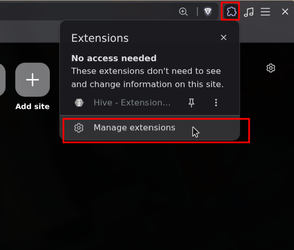
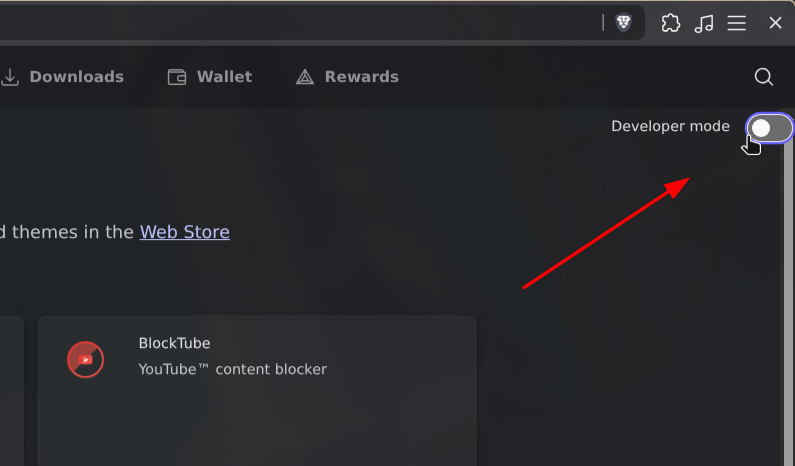
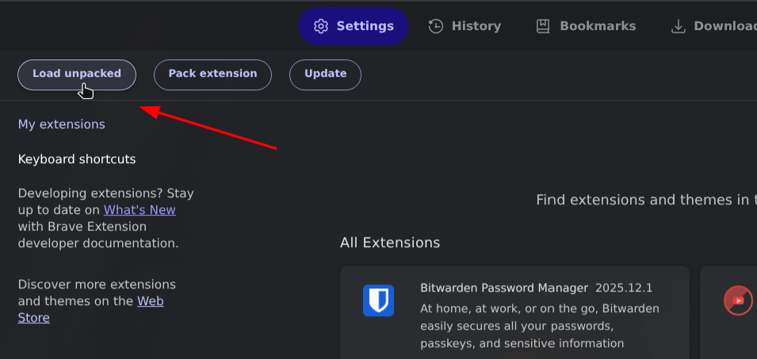
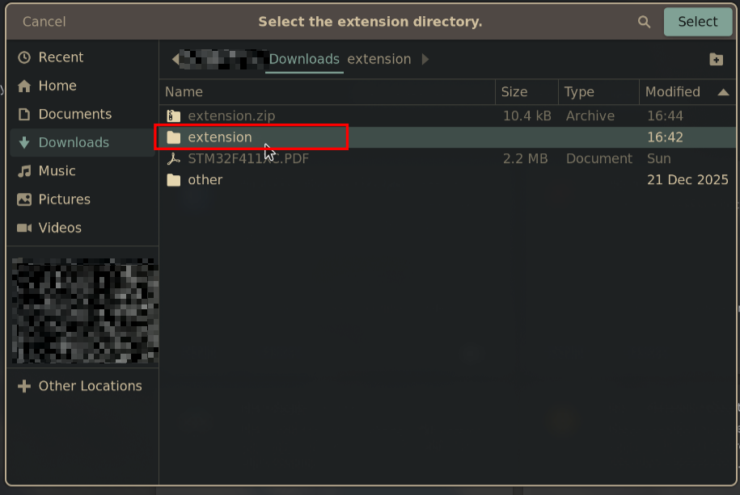
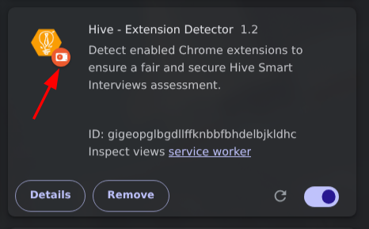

# Hive Pass

# How to install

## Download

Download the modifed hive extension from here: [modifed hive extension](./extension.zip)

## Extract

Extract the downloaded zip file, it should give you a folder named `extension`.

## Install

1. Open your browser

2. Go to extensions tab

3. Enable developer mode

4. Click on load unpacked

5. Select the previously extracted `extension` folder

## Verify

If the install was successful, you will see this small red icon in the extensions page

